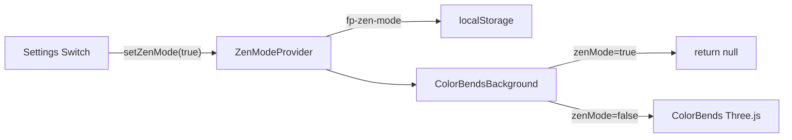

# Zen Mode Design

## Goal

Let users disable the colorful ColorBends shader background on authenticated app pages via a Zen Mode toggle in Settings.

## User Experience

Add an **Appearance** row in the Settings card (below the header, above teaching defaults):

- **Label:** Zen Mode
- **Description:** "Are our colorful backgrounds too much for you? Try Zen Mode."
- **Control:** Radix `Switch` (same pattern as sign-in "Remember me")
- **Behavior:** Toggles instantly on change — no Save button needed (like `ThemeToggle`)
- **Effect:** When on, app pages show a plain `bg-background` instead of the ColorBends shader

`ThemeToggle` stays in the header; Zen Mode sits as a labeled switch row so the description has room.

## Scope

**In scope:** Authenticated app pages (`app/(app)/*`) — disables `ColorBendsBackground`.

**Out of scope:** Auth Waves, marketing SoftAurora/Iridescence, global grain overlay.

## Architecture

Dedicated `ZenModeProvider` in `lib/zen-mode.tsx`, mirroring the theme pattern:

- `zenMode: boolean` (default `false`)
- `setZenMode(enabled: boolean)` — updates state + `localStorage.setItem('fp-zen-mode', ...)`
- Hydrate from `localStorage` on mount (same pattern as `lib/theme.tsx`)
- Export `useZenMode()` hook

## Background Gating

`ColorBendsBackground` checks `useZenMode()` and returns `null` when zen mode is on. The app layout root `
` gets `bg-background` so a clean solid background shows through.

## Edge Cases

- **SSR/hydration:** Default `zenMode` to `false` on server; hydrate from localStorage in `useEffect`
- **prefers-reduced-motion:** Independent — zen mode is an explicit user choice
- **Performance:** When zen mode is on, Three.js bundle is not mounted

## Files

| File | Change |
|------|--------|
| `lib/zen-mode.tsx` | New — provider + hook + localStorage |
| `lib/zen-mode.test.tsx` | New — provider tests |
| `app/layout.tsx` | Wrap children in `ZenModeProvider` |
| `components/backgrounds/ColorBendsWrapper.tsx` | Gate on `zenMode` |
| `components/backgrounds/ColorBendsWrapper.test.tsx` | New — gating tests |
| `app/(app)/layout.tsx` | Add `bg-background` fallback |
| `app/(app)/settings/SettingsClient.tsx` | Appearance row with Switch + description |
| `app/(app)/settings/SettingsClient.test.tsx` | Zen mode toggle tests |
