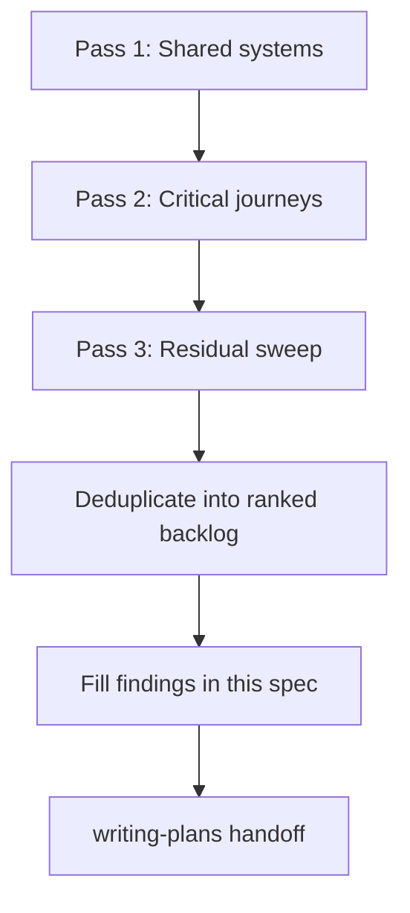

# Full-Site UI/UX Audit Design

## Goal

Produce a full-site UI/UX audit of FreePeriod as a design spec with a prioritized fix backlog. Implementation is deferred to a separate writing-plans phase after this spec is filled and approved.

Success means: every in-scope surface has been reviewed under the agreed lenses; findings are ranked for a balanced mix of conversion, daily-use polish, and cross-surface consistency; existing animations and effects are preserved (refine only, never remove).

## Scope

### In scope

All 14 user-facing routes plus shared chrome:

| Surface | Routes / assets |
| --- | --- |
| Marketing | `/`, `/pricing`, `/privacy`, `/terms` |
| Auth | `/sign-in`, `/sign-up`, `/forgot-password`, `/update-password`, `/onboarding` |
| App | `/dashboard`, `/generate`, `/history`, `/lesson/[id]`, `/settings` |
| Shared shells | Root / auth / app layouts, Navbar, marketing/legal footers, Logo, theme toggle, Zen Mode, grain overlay |

### Lenses (applied together)

1. **ux-heuristics** — Krug (Don't Make Me Think, click confidence, cut words, trunk test) + Nielsen's 10; severity 0–4
2. **better-ui** — concentric radius, optical alignment, shadows vs borders, interruptible motion, stagger, hit areas, scale-on-press (`0.96`), no `transition: all`, image outlines, `will-change` sparingly
3. **better-typography** — Manrope type scale/hierarchy, measure, wrap (`balance` / `pretty`), tabular nums, contrast floors, inputs ≥16px on mobile, antialiased root, natural-case copy
4. **Brand alignment** — [`docs/brand-guidelines.md`](../../brand-guidelines.md), tokens in `app/globals.css` and `assets/design-tokens.json`

### Hard constraints

1. **Do not remove** existing animations or effects (SoftAurora, Iridescence, ColorBends, Waves, BlurText, grain, generation overlay, SpotlightCard / MagicCard motion, `.btn-shine`, etc.). Recommendations may refine timing, stagger, interruptibility, or `prefers-reduced-motion` / Zen Mode behavior — never delete the effect.
2. **Balanced ranking** — conversion, daily-use, and consistency pillars are weighted evenly; severity × frequency decide order.
3. **This phase delivers documentation only** — no code fixes until a writing-plans implementation plan is approved and the user explicitly starts it.

### Out of scope

- Backend, API, billing logic correctness (except as it surfaces in UI copy/states)
- Drive-by refactors unrelated to ranked findings
- Stripping or replacing the established visual language for a new aesthetic

## Method (layer-first)

### Pass 1 — Shared systems

Audit once; apply everywhere:

- Tokens and surfaces (radius nesting, shadows vs borders, card/panel usage)
- Typography (scale, hierarchy, measure, wrap, form input sizes, contrast)
- Chrome (Logo, sticky headers, Navbar trunk-test, footers, theme/Zen)
- Motion inventory (every named effect → `keep` or `refine` only)
- Primitives (Button press scale, hit areas ≥40px desktop / ≥44px touch, icon optical centering, transition property specificity)

### Pass 2 — Critical journeys

Full lens stack on:

1. **Convert:** landing → pricing → sign-up → onboarding → dashboard empty → first generate
2. **Core loop:** dashboard → generate → generation overlay → lesson view/edit/export → history
3. **Account:** settings (defaults, theme, Zen, billing, delete) + password reset path

### Pass 3 — Residual sweep

Privacy/terms, forgot/update password edges, upgrade/empty/error/loading states not covered above — trunk test + residual checklist only.

### Evidence

Code review of mapped UI files; live screenshots/snapshots where visual judgment matters; companion used for side-by-side visual recommendations only.

## Finding taxonomy and ranking

### Fields per finding

| Field | Purpose |
| --- | --- |
| ID | Stable id (`UX-01`, `UI-03`, `TYP-02`, …) |
| Surface | Layer / journey / page |
| Principle | Skill + specific rule |
| Severity | 0–4 (ux-heuristics scale) |
| Frequency | Rare / occasional / common / every-session |
| Pillar | Conversion · Daily-use · Consistency (one or more) |
| Evidence | File path + brief before description |
| Recommendation | Concrete after (preserve motion; refine only) |
| Effort | S / M / L |

### Ranking

`priority = severity × frequency_weight`, then break ties by how many pillars the finding hits. No pillar receives a bonus over another.

Frequency weights: rare = 1, occasional = 2, common = 3, every-session = 4.

### Exclusions from backlog

- Severity 0
- Pure taste with no heuristic / UI / typography / brand violation
- Any “fix” that means deleting an animation or effect

### Deduping

Page-level symptoms collapse into one systemic finding when Pass 1 owns the root cause (e.g. one Button press-scale finding, not twelve copies).

## Deliverable

This document is the primary artifact. After the audit runs, it will contain:

1. Goals, scope, constraints (this section — locked)
2. Method (locked)
3. Scoring rubric (locked)
4. **Findings backlog** — ranked table with full finding-taxonomy fields; Before/After grouped by principle where useful
5. **Motion inventory** — every named effect with status `keep` or `refine`
6. Explicit non-goals
7. Handoff note for writing-plans

### Findings backlog (to be filled during audit)

| Priority | ID | Surface | Principle | Sev | Freq | Pillars | Effort | Recommendation |
| --- | --- | --- | --- | --- | --- | --- | --- | --- |
| — | — | — | — | — | — | — | — | *Pending audit execution* |

### Motion inventory (to be filled during audit)

| Effect | Where used | Status | Notes |
| --- | --- | --- | --- |
| SoftAurora | Marketing / pricing | keep or refine | *Pending* |
| Iridescence CTA | Landing CTA | keep or refine | *Pending* |
| ColorBends | App shell | keep or refine | Zen Mode already gates |
| Waves | Auth background | keep or refine | *Pending* |
| BlurText | App headings | keep or refine | *Pending* |
| Grain overlay | Global | keep or refine | *Pending* |
| GenerationScreen | Generate flow | keep or refine | *Pending* |
| SpotlightCard / MagicCard | Marketing / pricing | keep or refine | *Pending* |
| `.btn-shine` / other micro | CTAs | keep or refine | *Pending* |

## Non-goals

- Removing or replacing brand motion for a flatter UI
- Rewriting product strategy or pricing model
- Implementing fixes in the same phase as the audit

## Process gates

1. Methodology design approved (this document’s locked sections).
2. User reviews this written spec.
3. **Start gate:** user explicitly confirms readiness before Pass 1–3 runs and the backlog is filled.
4. User reviews the completed findings backlog.
5. Invoke **writing-plans** only for implementation; no code until that plan is approved.

## Success criteria

- Full-site coverage per the three-pass method
- Every finding ranked per the taxonomy
- Motion inventory complete with `keep` / `refine` only
- Balanced pillars; ready for phased implementation planning
