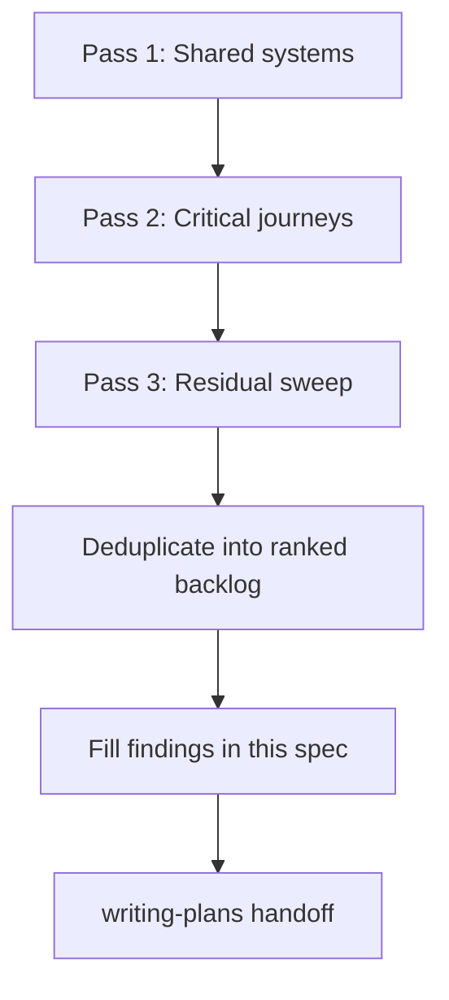

# Full-Site UI/UX Audit Design

## Goal

Produce a full-site UI/UX audit of FreePeriod as a design spec with a prioritized fix backlog. Implementation is deferred to a separate writing-plans phase after this spec is filled and approved.

Success means: every in-scope surface has been reviewed under the agreed lenses; findings are ranked for a balanced mix of conversion, daily-use polish, and cross-surface consistency; existing animations and effects are preserved (refine only, never remove).

## Scope

### In scope

All 14 user-facing routes plus shared chrome:

| Surface | Routes / assets |
| --- | --- |
| Marketing | `/`, `/pricing`, `/privacy`, `/terms` |
| Auth | `/sign-in`, `/sign-up`, `/forgot-password`, `/update-password`, `/onboarding` |
| App | `/dashboard`, `/generate`, `/history`, `/lesson/[id]`, `/settings` |
| Shared shells | Root / auth / app layouts, Navbar, marketing/legal footers, Logo, theme toggle, Zen Mode, grain overlay |

### Lenses (applied together)

1. **ux-heuristics** — Krug (Don't Make Me Think, click confidence, cut words, trunk test) + Nielsen's 10; severity 0–4
2. **better-ui** — concentric radius, optical alignment, shadows vs borders, interruptible motion, stagger, hit areas, scale-on-press (`0.96`), no `transition: all`, image outlines, `will-change` sparingly
3. **better-typography** — Manrope type scale/hierarchy, measure, wrap (`balance` / `pretty`), tabular nums, contrast floors, inputs ≥16px on mobile, antialiased root, natural-case copy
4. **Brand alignment** — [`docs/brand-guidelines.md`](../../brand-guidelines.md), tokens in `app/globals.css` and `assets/design-tokens.json`

### Hard constraints

1. **Do not remove** existing animations or effects (SoftAurora, Iridescence, ColorBends, Waves, BlurText, grain, generation overlay, SpotlightCard / MagicCard motion, `.btn-shine`, etc.). Recommendations may refine timing, stagger, interruptibility, or `prefers-reduced-motion` / Zen Mode behavior — never delete the effect.
2. **Balanced ranking** — conversion, daily-use, and consistency pillars are weighted evenly; severity × frequency decide order.
3. **This phase delivers documentation only** — no code fixes until a writing-plans implementation plan is approved and the user explicitly starts it.

### Out of scope

- Backend, API, billing logic correctness (except as it surfaces in UI copy/states)
- Drive-by refactors unrelated to ranked findings
- Stripping or replacing the established visual language for a new aesthetic

## Method (layer-first)

### Pass 1 — Shared systems

Audit once; apply everywhere:

- Tokens and surfaces (radius nesting, shadows vs borders, card/panel usage)
- Typography (scale, hierarchy, measure, wrap, form input sizes, contrast)
- Chrome (Logo, sticky headers, Navbar trunk-test, footers, theme/Zen)
- Motion inventory (every named effect → `keep` or `refine` only)
- Primitives (Button press scale, hit areas ≥40px desktop / ≥44px touch, icon optical centering, transition property specificity)

### Pass 2 — Critical journeys

Full lens stack on:

1. **Convert:** landing → pricing → sign-up → onboarding → dashboard empty → first generate
2. **Core loop:** dashboard → generate → generation overlay → lesson view/edit/export → history
3. **Account:** settings (defaults, theme, Zen, billing, delete) + password reset path

### Pass 3 — Residual sweep

Privacy/terms, forgot/update password edges, upgrade/empty/error/loading states not covered above — trunk test + residual checklist only.

### Evidence

Code review of mapped UI files across six scoped auditors (shared systems, marketing, auth, generate journey, lesson/history, settings/residual). Live preview also surfaced a pricing runtime error (`toggleRef` / related theme toggle) during orchestration; if still present at implementation time, treat as a blocking conversion defect alongside UX-02-class motion bugs.

## Finding taxonomy and ranking

### Fields per finding

| Field | Purpose |
| --- | --- |
| ID | Stable id (`UX-01`, `UI-03`, `TYP-02`, …) |
| Surface | Layer / journey / page |
| Principle | Skill + specific rule |
| Severity | 0–4 (ux-heuristics scale) |
| Frequency | Rare / occasional / common / every-session |
| Pillar | Conversion · Daily-use · Consistency (one or more) |
| Evidence | File path + brief before description |
| Recommendation | Concrete after (preserve motion; refine only) |
| Effort | S / M / L |

### Ranking

`priority = severity × frequency_weight`, then break ties by how many pillars the finding hits. No pillar receives a bonus over another.

Frequency weights: rare = 1, occasional = 2, common = 3, every-session = 4.

### Exclusions from backlog

- Severity 0
- Pure taste with no heuristic / UI / typography / brand violation
- Any “fix” that means deleting an animation or effect

### Deduping

Page-level symptoms collapse into one systemic finding when Pass 1 owns the root cause (e.g. one Button press-scale finding, not twelve copies).

**Deduped in this fill:**

| Collapsed symptoms | Canonical finding |
| --- | --- |
| Password reveal `p-1` targets on sign-in, sign-up, update-password | UI-04 |
| `alert()` feedback on Settings save and Generate validation | UX-07 |
| Skeleton `bg-gray-*` on Settings and History | UI-08 |
| Opaque auth page roots hiding Waves (sign-in, sign-up, onboarding) | UI-05 |
| `text-[10px]` / low-contrast dates on dashboard and history cards | TYP-03 |
| Marketing/nav/footer undersized text links | UI-03 |
| Marketing CTA missing `active:scale-[0.96]` + shared Button press pattern | UI-02 |
| `prefers-reduced-motion` gaps across multiple effects | Motion inventory + UX-02 / UX-11 |

## Deliverable status

Audit execution complete. Findings backlog and motion inventory filled below. Next gate: user review of this completed backlog, then writing-plans for implementation.

---

## Findings backlog (ranked)

Priority = severity × frequency_weight. Tie-break: more pillars first, then lower effort.

| Priority | ID | Surface | Principle | Sev | Freq | Pillars | Effort | Evidence | Recommendation |
| --- | --- | --- | --- | --- | --- | --- | --- | --- | --- |
| 16 | UX-01 | Auth / sign-up | Match system to journey | 4 | every-session | Conversion | S | `SignUpPage.tsx` always `router.push('/dashboard')` after signup | Route new users to `/onboarding` unless onboarding already complete |
| 12 | UX-02 | Landing `/` | Visibility / error prevention | 4 | rare→treated as every-session for a11y cohort | Conversion, Daily-use | S | `[data-animate]` stays `opacity: 0` when `prefersReduced` early-returns | Force `opacity: 1` / reset transforms under reduced motion; keep stagger for others |
| 12 | UX-03 | Lesson edit | User control & freedom | 4 | common | Daily-use | M | `SectionCard`/`LessonEditor` `onBlur={onDone}`; toolbar clicks blur and exit edit | Prevent toolbar mousedown blur or decouple blur from exit; keep inline edit + save flash |
| 12 | UX-04 | History | Hit areas & discoverability | 4 | common | Daily-use, Consistency | S | Delete control `opacity-0 group-hover:opacity-100` | Always show on coarse pointers; keep hover fade on fine pointers; ≥44×44 |
| 12 | UX-05 | Generate overlay | Error recovery & user control | 4 | occasional | Daily-use, Conversion | S | Non-402/stream errors never clear `isGenerating`; overlay traps | On terminal error, dismiss or show “Back to form”; keep GenerationScreen motion on happy path |
| 12 | UI-01 | Shared `Button` | Hit areas ≥40/44px | 3 | every-session | Daily-use, Consistency | M | Default `h-8`; `sm`/`xs`/`icon` below brand minimum | Raise touch defaults to ≥44px; preserve `btn-shine` + spotlight |
| 12 | UX-06 | Generate form→overlay | Visibility of system status | 3 | every-session | Daily-use, Consistency | S | `onSubmit` not awaited; `isSubmitting` clears while overlay open | Drive loading from `isGenerating` / await parent submit |
| 12 | TYP-01 | Generate form | Inputs ≥16px on mobile | 3 | every-session | Daily-use, Consistency | S | Teacher-prompt `textarea` uses `text-sm` | Use `text-base` to match `Input` |
| 12 | UX-07 | Settings + Generate | Visibility of system status | 3 | common | Daily-use, Consistency | S | `alert()` on Settings save and Generate required-field validation | Inline toast/`role="status"` or field errors; keep button loading states |
| 12 | UX-08 | Settings | Trunk test / account completeness | 3 | every-session | Daily-use, Consistency | M | Account section has logout/delete only; no email/plan/billing | Add read-only email + plan/trial + manage-subscription link |
| 12 | TYP-02 | History search | Inputs ≥16px on mobile | 3 | every-session | Daily-use, Consistency | S | Search `text-sm` | `text-base md:text-sm`; keep coral focus ring |
| 9 | UX-09 | Auth / sign-in | User control & freedom | 3 | common | Conversion, Consistency | M | `rememberMe` Switch never wired to auth persistence | Wire session persistence or clarify copy; keep Switch styling |
| 9 | UX-10 | Generate form | Error prevention & recovery | 3 | common | Daily-use, Consistency | S | (Canonical with UX-07 for Generate branch) required fields use `alert` | Field-level errors under Subject/Grade |
| 9 | UI-04 | Auth password toggles | Touch hit areas ≥44px | 3 | common | Daily-use, Consistency | S | Sign-in/up + update-password toggles use `p-1` + 18px icons | `min-h-11 min-w-11` centered icon; keep `transition-colors` |
| 9 | UX-11 | History search | Visibility of system status | 3 | common | Daily-use | M | Every keystroke refetches and swaps full pulse skeleton | Debounce ~300ms; filter in place; keep pulse for initial load |
| 9 | UI-15 | History delete control | Hit areas ≥44px | 3 | common | Daily-use | S | Delete ≈36px with `p-2.5` | Expand to 44×44; keep trash icon + hover color |
| 8 | UX-12 | Generate overlay | Visibility of system status | 3 | occasional | Daily-use | S | Errors are text-only; no recovery CTA | “Try again” / dismiss; keep animejs step motion |
| 8 | UX-13 | Upload zones | Match system and real world | 3 | occasional | Daily-use, Conversion | M | Copy says “Click or drag” but no drop handlers | Implement DnD **or** change copy to “Click to upload”; keep transitions |
| 8 | UX-14 | Pricing SoftAurora | Respectful motion | 3 | occasional | Consistency, Daily-use | S | SoftAurora always mounted on pricing; landing gates PRM | Mirror landing PRM gate; keep shader params |
| 8 | UX-15 | Pricing checkout | Visibility of system status | 3 | occasional | Conversion | M | Failed checkout shows spinner path with no error message | Inline error under cards; keep spinner + `btn-shine` |
| 8 | UX-16 | Update password | Error recovery | 3 | occasional | Conversion | S | No expired-session empty state / link to forgot-password | Actionable banner + “Request a new reset link” |
| 8 | UX-17 | Lesson export | Visibility of system status | 3 | occasional | Daily-use | S | Failed export/`!response.ok` returns silently | Inline error or toast; keep loading spinners |
| 8 | TYP-04 | Onboarding custom input | Inputs ≥16px on mobile | 3 | occasional | Conversion, Consistency | S | Raw subject `<input>` uses `text-sm` | `text-base` to match shared `Input` |
| 8 | UX-18 | Auth / sign-up | Visibility of system status | 3 | occasional | Conversion | M | Redirects even when `session` null (email confirm path) | In-card “Check your email” success state; keep card shell |
| 8 | UX-19 | Onboarding finish | Visibility of system status | 3 | occasional | Conversion, Daily-use | S | Success only `router.push`; can stall with no fallback | Brief “Saving…/Redirecting…” or timeout fallback; keep Finish loading |
| 8 | UI-02 | Shared `Button` + marketing CTAs | Scale-on-press `0.96`; no `transition: all` | 2 | every-session | Daily-use, Consistency, Conversion | S | `active:translate-y-px` + `transition-all`; marketing CTAs lack press scale | `active:scale-[0.96]` + explicit transition props; preserve shine/spotlight |
| 8 | UI-03 | Navbar + marketing + footer chrome | Touch targets | 2 | every-session | Daily-use, Consistency, Conversion | S | Icon-only nav / text links often &lt;44px | `min-h-[44px]` on nav/footer/marketing header links; keep blur chrome |
| 8 | UI-05 | Auth shell vs Waves | Surfaces vs motion backdrop | 2 | every-session | Consistency, Conversion | S | Auth pages use opaque `bg-background` full viewport over Waves | Transparent/`bg-background/80` roots so Waves remain visible |
| 6 | UX-20 | Generate cancel | Interruptible motion / user control | 2 | every-session | Daily-use | M | `abortRef` unused; fullscreen overlay blocks cancel | “Cancel generation” that aborts + dismisses; keep PRM gate |
| 6 | UI-06 | Onboarding chrome | Brand / card consistency | 2 | every-session | Consistency, Conversion | M | No Logo/Card; progress is `{step} / 3` text only | Add Logo + Card shell + segmented progress; keep step animejs |
| 6 | UX-21 | Auth async actions | Feedback on async actions | 2 | common | Conversion | S | Google/magic-link lack loading/disable while email submit has it | Shared loading that disables all auth actions |
| 6 | TYP-03 | Dashboard + history metadata | Contrast & size floors | 2 | common | Daily-use, Consistency | S | Dates use `text-[10px]` + `/60` opacity | `text-xs` and higher opacity |
| 6 | UX-22 | Lesson autosave | Visibility of system status | 2 | common | Daily-use | M | Debounced save has no UI; flash only on Done | Header “Saving…/Saved” + optional flash on autosave |
| 6 | UI-07 | ThemeToggle | Hit areas | 2 | common | Daily-use, Consistency | S | `h-10 w-10` (40px) | `h-11 w-11` (44px); keep coral focus |
| 6 | BR-01 | Tokens & surfaces | Brand token fidelity | 2 | common | Consistency | M | `--text-secondary` drift; Input/Card vs token JSON; Button uses oklch primary vs coral | Align tokens; bridge primary→coral; keep elevation/motion |
| 6 | UX-23 | Auth layout stacking | Visibility / error prevention | 2 | common | Conversion, Daily-use | S | Auth children lack `relative z-10` over absolute Waves | Wrap children in `relative z-10`; keep Waves |
| 6 | UX-24 | Focus visibility | Recognition over recall | 2 | common | Daily-use, Consistency | S | Global outline + Button ring + ThemeToggle outline conflict | One documented focus pattern |
| 6 | UI-08 | Skeletons | Token consistency | 2 | common | Consistency | S | Settings/History skeletons use `bg-gray-*` | `bg-surface` / `border-border` like lesson skeleton |
| 4 | UX-25 | Forgot password | Error recovery / next step | 2 | occasional | Conversion | S | Success lacks resend + spam guidance | Resend with cooldown + spam hint |
| 4 | UI-09 | Auth recovery screens | Cross-route visual consistency | 2 | occasional | Consistency | M | Forgot vs update-password shell/logo/footer differ | Shared auth-card shell; keep shadows |
| 4 | UX-26 | Pricing billing toggle | Match system / affordance | 2 | occasional | Conversion, Consistency | M | Annual uses `role="switch"` on two-option control | `tablist`/`tab` or radiogroup; keep pill styling |
| 4 | UX-27 | Pricing trial copy | Consistency / trust | 2 | occasional | Conversion | S | Footer “30-day free trial” conflicts with Free $0 | Clarify trial applies to paid tiers |
| 4 | TYP-05 | Pricing prices | Tabular nums | 2 | occasional | Conversion, Consistency | S | Price spans lack `tabular-nums` | Add on price row + annual subline |
| 4 | BR-02 | UpgradePrompt | Tokens & type system | 2 | occasional | Conversion, Consistency | M | Hardcoded hex + `font-nunito` | Map to coral/surface tokens + Manrope; keep animejs entrance |
| 4 | UX-28 | Legal pages | Trunk test / wayfinding | 2 | occasional | Conversion, Consistency | M | Long docs, no TOC | Compact TOC with `#` anchors; keep legal typography |
| 4 | TYP-06 | Legal body | Contrast floors | 2 | occasional | Conversion, Consistency | S | Body uses `text-text-secondary` | `text-text-primary` for prose; secondary for metadata |
| 4 | UX-29 | Onboarding motion | Interruptible motion / a11y | 2 | occasional | Consistency, Daily-use | S | Step animejs has no PRM gate | Instant opacity under PRM; keep animation for default |
| 4 | UX-30 | Lesson view motion | Zen parity | 2 | common | Consistency | S | Card stagger gates PRM only, not Zen | Also skip/shorten under Zen; keep stagger otherwise |
| 4 | UX-31 | History empty | Recognition & recovery | 2 | occasional | Conversion, Daily-use | S | “No lessons yet.” with no CTA | Link/button to `/generate` |
| 4 | UX-32 | SectionCard collapse while editing | Error prevention | 2 | occasional | Daily-use | S | Collapse can unmount editing content | Disable collapse while editing |
| 4 | UX-33 | Dashboard history link | Recognition over recall | 2 | common | Daily-use, Conversion | S | “View all” only when ≥9 lessons | Persistent `/history` link when any lessons exist |
| 4 | UI-10 | Dashboard CTAs | Primitive consistency | 2 | every-session | Consistency, Conversion | S | Raw `Link` + `btn-shine`, not `Button asChild` | Use `Button asChild`; preserve shine |
| 4 | TYP-07 | Input label motion | No `transition: all` | 2 | every-session | Daily-use | S | `Input` label uses `transition-all` | Explicit properties; keep float behavior |
| 4 | UX-34 | Sign-up terms | Error recovery | 2 | occasional | Conversion | S | Terms failure via `setServerError` | Inline under checkbox |
| 4 | UX-35 | Auth error copy | Plain language | 2 | occasional | Conversion | M | Raw Supabase `error.message` | Map common errors to short actionable copy |
| 4 | UX-36 | Generate custom duration | Error prevention | 2 | occasional | Daily-use | S | Empty custom duration not validated | Required numeric range inline error |
| 4 | UX-37 | Settings dirty state | Recognition over recall | 2 | common | Daily-use | S | Save always enabled | Dirty tracking + disable until changed |
| 4 | UX-38 | Settings legal links | Match system | 2 | occasional | Daily-use, Consistency | S | `target="_blank"` to privacy/terms | Same-tab or labeled new-tab |
| 4 | UX-39 | Landing CTA copy | Clarity / cut words | 2 | every-session | Conversion | S | Truncated “No credit” | Full “No credit card required.” |
| 3 | UI-11 | Marketing header CTA | Consistency | 2 | every-session | Consistency, Conversion | S | Landing vs pricing Sign-in button radius/hit area differ | One pattern (`rounded-xl`, `min-h-[44px]`) |
| 2 | BR-03 | Pro+ CTA | Brand tokens | 1 | occasional | Consistency | S | Hardcoded `text-[#1A1A2E]` | Tokenized on-mustard text |
| 2 | UI-12 | SpotlightCard / MagicCard | Pointer-only polish | 1 | common | Daily-use | M | Mouse-only follow effects | Pointer/focus-within fallbacks; keep gradients |
| 2 | UI-13 | MarketingFooter | Hit areas | 1 | occasional | Conversion | S | Footer links lack min hit area | `min-h-[44px] inline-flex` |
| 2 | UI-14 | HeroPictogram | `will-change` sparingly | 1 | every-session | Daily-use | S | Persistent `willChange` during breathe loop | Clear after entrance; keep animation |
| 2 | UX-40 | Pricing checkout a11y | Visibility of system status | 2 | occasional | Conversion, Daily-use | S | Spinner without `aria-busy` | `aria-busy` + sr-only Loading |
| 2 | UX-41 | Legal effective date | Consistency / redundancy | 2 | occasional | Consistency | S | Shell + content both show effective date | Keep one source of truth |
| 2 | UX-42 | Auth Suspense | Visibility of system status | 2 | occasional | Consistency | S | Forgot/update password Suspense has no fallback | Auth-card skeleton pulse |
| 2 | TYP-08 | Update password hint | Contrast / legibility | 2 | common | Daily-use | S | Hint `text-xs text-text-secondary` | `text-sm`; keep secondary token |
| 2 | UX-43 | Lesson back link | Hit areas | 2 | every-session | Daily-use, Consistency | S | “Back to Dashboard” text-only | `min-h-[44px] inline-flex` |
| 2 | TYP-09 | Lesson editor prose | Inputs ≥16px mobile | 2 | common | Daily-use | S | `prose-sm` on editor | `prose-base sm:prose-sm` |
| 2 | UX-44 | Sign-up checkbox | Touch hit areas | 2 | every-session | Conversion, Consistency | S | Terms checkbox `h-4 w-4` | Padded label / 44px row hit area |
| 2 | UX-45 | Onboarding error placement | Error visibility | 2 | occasional | Conversion | S | Error below animated container | Move inside active step card |
| 2 | UX-46 | Landing PRM init | Interruptible / respectful motion | 2 | rare | Consistency, Daily-use | S | `prefersReduced` defaults false until after paint | Sync `matchMedia` before animejs |

### Before / After (by principle)

#### Visibility of system status
| Before | After |
| --- | --- |
| `alert()` / silent failures / trapped overlay | Inline status, toasts, recovery CTAs; clear generating state on error |
| Remember-me / dirty Save / autosave invisible | Wired persistence, dirty Save, “Saving…/Saved” |

#### User control & freedom
| Before | After |
| --- | --- |
| Toolbar blur exits lesson edit | Toolbar mousedown does not blur; edit stays open |
| Generation overlay cannot cancel | Cancel aborts fetch and dismisses overlay |

#### Touch hit areas & scale-on-press
| Before | After |
| --- | --- |
| Buttons `h-8`, icon toggles `p-1`, hover-only delete | ≥44px targets; coarse-pointer-visible delete; `active:scale-[0.96]` |

#### Typography (mobile inputs & measure)
| Before | After |
| --- | --- |
| `text-sm` / `text-[10px]` on key inputs and dates | `text-base` on mobile inputs; `text-xs`+ readable metadata; `tabular-nums` on prices |

#### Motion (refine only)
| Before | After |
| --- | --- |
| PRM leaves hero at opacity 0; pricing aurora ungated | Content visible under PRM; SoftAurora gated; animations kept for default users |

---

## Motion inventory

| Effect | Where used | Status | Notes |
| --- | --- | --- | --- |
| SoftAurora | `/`, `/pricing` | refine | Gate pricing on `prefers-reduced-motion` like landing; keep shader params |
| Iridescence CTA | Landing CTA | keep | Already null when reduced motion |
| ColorBends | App shell | refine | Zen already gates; add PRM fallback (static/`bg-background`) |
| Waves | Auth background | refine | Keep physics; fix stacking + opaque page roots so effect is visible; PRM static gradient fallback |
| BlurText | App / settings / history / lesson headings | refine | Keep entrance; ensure PRM/Zen renders static text immediately |
| Grain overlay | Global root | refine | Reduce/disable under PRM + Zen; do not remove for default users |
| GenerationScreen | Generate flow | refine | Keep fade + step stagger; fix error exit path; add cancel; PRM opacity-before-paint polish |
| SpotlightCard | Landing features + CTA | refine | Keep radial follow; add pointer/focus-within fallback |
| MagicCard | Pricing tiers | keep | Optional coarse-pointer static glow; preserve hover gradient |
| `.btn-shine` | CTAs / Button variants | refine | Keep keyframes; add PRM media query to suppress sweep |
| Button spotlight (mousemove) | `Button.tsx` | refine | Skip tracking under PRM/Zen; keep opacity transition |
| HeroPictogram | Landing + GenerationScreen | refine | Keep breathe/entrance; clear persistent `will-change` after entrance |
| Landing animejs stagger | `/` hero + features | refine | Keep timings; fix opacity reset under PRM; sync matchMedia before animate |
| Onboarding step animejs | Onboarding | refine | Keep translateX/opacity; add PRM instant path |
| Lesson card stagger | LessonView | refine | Keep stagger; also gate on Zen Mode |
| SectionCard save flash | Lesson sections | refine | Keep green border flash; also trigger on debounced autosave |
| UpgradePrompt animejs | Upgrade dialog | refine | Keep entrance; sync with Dialog open to avoid double-fade |
| AnimatedDropdown | Generate, onboarding, settings, history | keep | Preserve open/close; verify Escape/outside interruptibility |
| ShinyText | Landing features heading | keep | Confirm PRM behavior in implementation |
| `animate-pulse` skeletons | Dashboard, generate, history, settings, lesson | refine | Keep pulse; tokenize gray skeletons to surface tokens |
| `Loader2` / button `isLoading` | Auth, settings, exports, checkout | keep | Standard loading affordance |
| Chevron rotate | SectionCard accordion | keep | Property-specific transform |
| Card hover shadow | History / dashboard cards | keep | `transition-shadow` only |
| Theme toggle / nav / footer color transitions | Chrome | keep | Color-only |
| Floating theme toggle fade-in | Landing | refine | Show immediately under PRM; keep delayed entrance otherwise |
| Switch toggle | Sign-in Remember me | keep | Preserve coral checked state |
| Input label float | Shared Input | refine | Keep float; narrow `transition-all` to specific props |

---

## Non-goals

- Removing or replacing brand motion for a flatter UI
- Rewriting product strategy or pricing model
- Implementing fixes in the same phase as the audit
- Drive-by refactors unrelated to the ranked backlog above

## Writing-plans handoff

Implementation-ready synthesis lives in:

**[`2026-07-17-full-site-uiux-audit-implementation-backlog.md`](./2026-07-17-full-site-uiux-audit-implementation-backlog.md)**

That doc merges findings into 22 work items (W-*), assigns owners/files, phases P0–P3 with effort (~33.5d), dependencies, and a writing-plans checklist. After you approve it:

1. Invoke **writing-plans** only (no other implementation skills).
2. Prefer one plan per phase (or per owner cluster within a phase).
3. Each plan task must preserve motion (refine-only notes from the inventory).
4. No code until a plan is approved and the user explicitly starts implementation.

## Process gates

1. Methodology design approved — done
2. User reviews written methodology — done
3. Start gate before Pass 1–3 — done (orchestrated audit)
4. User reviews completed findings backlog — done
5. **User reviews implementation backlog synthesis** — waiting
6. Invoke writing-plans for implementation — after synthesis approval

## Success criteria

- [x] Full-site coverage per the three-pass method (six scoped auditors)
- [x] Every finding ranked per the taxonomy
- [x] Motion inventory complete with `keep` / `refine` only
- [x] Balanced pillars; ready for phased implementation planning
