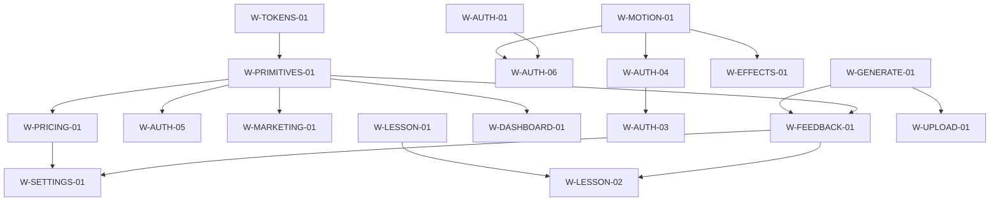

# Full-Site UI/UX Audit — Implementation Backlog

Synthesis of [`2026-07-17-full-site-uiux-audit-design.md`](./2026-07-17-full-site-uiux-audit-design.md). Documentation only — no application code. Motion remains **refine only** (never remove).

## 1. Merge log

| Merged finding IDs | Canonical work item ID |
| --- | --- |
| UX-01, UX-18 | W-AUTH-01 |
| UX-02, UX-14, UX-29, UX-30, UX-46 | W-MOTION-01 |
| UX-03, UX-32 | W-LESSON-01 |
| UX-04, UI-15 | W-HISTORY-01 |
| UX-05, UX-06, UX-12, UX-20 | W-GENERATE-01 |
| UI-01, UI-02, UI-07, UX-24, TYP-07 | W-PRIMITIVES-01 |
| UX-07, UX-10, UX-36, TYP-01 | W-FEEDBACK-01 |
| UX-08, UX-37, UX-38 | W-SETTINGS-01 |
| UX-11, TYP-02, TYP-03, UX-31 | W-HISTORY-02 |
| UX-16, UX-25, UI-09, UX-42, TYP-08 | W-AUTH-03 |
| UI-04, UX-21, UX-34, UX-35, UX-44 | W-AUTH-05 |
| UI-03, UI-11, UI-13, UX-39 | W-MARKETING-01 |
| UX-15, UX-26, UX-27, UX-40, TYP-05, BR-02, BR-03 | W-PRICING-01 |
| UX-17, UX-22, UX-43, TYP-09 | W-LESSON-02 |
| BR-01, UI-08 | W-TOKENS-01 |
| UX-28, TYP-06, UX-41 | W-LEGAL-01 |
| UX-33, UI-10 | W-DASHBOARD-01 |
| UI-12, UI-14 | W-EFFECTS-01 |

Unmerged single findings promoted to work items: UX-09 → W-AUTH-02; UI-05 + UX-23 → W-AUTH-04; UI-06 + UX-19 + TYP-04 + UX-45 → W-AUTH-06; UX-13 → W-UPLOAD-01.

## 2. Implementation backlog

Score = highest source-finding score in the merged item. Bands: P0 ≥12, P1 8–11, P2 4–7, P3 ≤3.

| Work ID | Title | Source IDs | Band | Score | Effort | Pillars | Owner | Affected files | Depends on | Recommendation |
| --- | --- | --- | --- | ---: | --- | --- | --- | --- | --- | --- |
| W-AUTH-01 | Complete the new-user sign-up journey | UX-01, UX-18 | P0 | 16 | M | Conversion | auth | `app/(auth)/sign-up/SignUpPage.tsx`; `app/auth/callback/route.ts`; `app/(auth)/onboarding/OnboardingPage.tsx` | — | Route first-time users to onboarding; show in-card email-confirm success when session is null |
| W-MOTION-01 | Make motion accessible without removing effects | UX-02, UX-14, UX-29, UX-30, UX-46 | P0 | 12 | L | Conversion, Daily-use, Consistency | tokens | `app/page.tsx`; `features/billing/components/PricingClient.tsx`; `app/(auth)/onboarding/OnboardingPage.tsx`; `features/lesson/components/LessonView.tsx`; `components/backgrounds/ColorBendsWrapper.tsx`; `components/animations/GrainOverlayClient.tsx`; `components/animations/GenerationScreen.tsx`; `components/ui/BlurText.tsx`; `components/ui/Button.tsx`; `components/ui/UpgradePrompt.tsx` | Pull W-TOKENS-01 early for shared motion rules | PRM/Zen show visible static content; keep all default effects with refined gating |
| W-LESSON-01 | Preserve inline lesson edits | UX-03, UX-32 | P0 | 12 | M | Daily-use | lesson | `features/lesson/components/SectionCard.tsx`; `features/lesson/components/LessonEditor.tsx`; `features/lesson/components/LessonView.tsx` | — | Keep editor open during toolbar use; block collapse while editing |
| W-HISTORY-01 | Make lesson deletion discoverable and touch-safe | UX-04, UI-15 | P0 | 12 | S | Daily-use, Consistency | history | `features/history/components/HistoryClient.tsx` | — | Always show 44×44 delete on coarse pointers; keep hover fade on fine pointers |
| W-GENERATE-01 | Repair the generation lifecycle and recovery | UX-05, UX-06, UX-12, UX-20 | P0 | 12 | L | Conversion, Daily-use, Consistency | generate | `features/generate/components/GenerateClient.tsx`; `features/generate/components/GenerateForm.tsx`; `components/animations/GenerationScreen.tsx`; `lib/generation/map-error.ts` | W-FEEDBACK-01 | One state machine for submit/error/retry/cancel; keep GenerationScreen motion on success |
| W-PRIMITIVES-01 | Standardize interactive control accessibility | UI-01, UI-02, UI-07, UX-24, TYP-07 | P0 | 12 | M | Conversion, Daily-use, Consistency | shared-primitives | `components/ui/Button.tsx`; `components/ui/Input.tsx`; `components/ui/ThemeToggle.tsx`; `app/globals.css`; `app/page.tsx`; `features/billing/components/PricingClient.tsx` | W-TOKENS-01 first | Documented 44px targets, focus, explicit transitions, `active:scale-[0.96]`; keep shine/spotlight |
| W-FEEDBACK-01 | Replace blocking feedback with inline validation | UX-07, UX-10, UX-36, TYP-01 | P0 | 12 | M | Daily-use, Consistency | shared-primitives | `features/generate/components/GenerateForm.tsx`; `features/generate/components/GenerateClient.tsx`; `app/(app)/settings/SettingsClient.tsx`; `components/ui/Input.tsx`; `components/ui/Button.tsx` | W-PRIMITIVES-01; W-GENERATE-01 for gen state | Replace `alert()` with inline status; validate custom duration; 16px mobile prompt |
| W-SETTINGS-01 | Complete account context and change feedback | UX-08, UX-37, UX-38 | P0 | 12 | M | Daily-use | settings | `app/(app)/settings/SettingsClient.tsx`; `app/(app)/settings/page.tsx`; `lib/lemonsqueezy/subscriptions.ts`; `components/ui/TrialBanner.tsx` | W-FEEDBACK-01; W-PRICING-01 for copy | Email/plan context, manage-sub path, dirty Save, intentional legal links |
| W-HISTORY-02 | Stabilize history search and empty states | UX-11, TYP-02, TYP-03, UX-31 | P0 | 12 | M | Conversion, Daily-use, Consistency | history | `features/history/components/HistoryClient.tsx`; `components/ui/skeleton.tsx` | — | Debounce search; keep grid during refresh; readable type; empty-state Generate CTA |
| W-AUTH-02 | Make “Remember me” truthful | UX-09 | P1 | 9 | M | Conversion, Consistency | auth | `app/(auth)/sign-in/SignInPage.tsx`; `lib/supabase/client.ts` | Product decision on session duration | Wire persistence or clarify/remove promise; keep Switch styling |
| W-AUTH-03 | Make password recovery resilient | UX-16, UX-25, UI-09, UX-42, TYP-08 | P1 | 8 | M | Conversion, Consistency | auth | `app/(auth)/forgot-password/ForgotPasswordPage.tsx`; `app/(auth)/update-password/UpdatePasswordPage.tsx`; `app/(auth)/layout.tsx`; `components/ui/Logo.tsx` | W-AUTH-04 | Unified recovery shell; Suspense; expired-link; resend/spam guidance |
| W-AUTH-04 | Restore Waves visibility in auth routes | UI-05, UX-23 | P1 | 8 | S | Conversion, Daily-use, Consistency | auth | `app/(auth)/layout.tsx`; `components/animations/AuthBackground.tsx`; `app/(auth)/sign-in/SignInPage.tsx`; `app/(auth)/sign-up/SignUpPage.tsx`; `app/(auth)/onboarding/OnboardingPage.tsx` | W-MOTION-01 | Keep Waves; translucent roots + `z-10` stacking |
| W-AUTH-05 | Harden auth form controls and feedback | UI-04, UX-21, UX-34, UX-35, UX-44 | P1 | 9 | M | Conversion, Daily-use, Consistency | auth | `app/(auth)/sign-in/SignInPage.tsx`; `app/(auth)/sign-up/SignUpPage.tsx`; `app/(auth)/update-password/UpdatePasswordPage.tsx`; `components/ui/Input.tsx`; `components/ui/Button.tsx` | W-PRIMITIVES-01; W-FEEDBACK-01 | Shared loading; 44px toggles/terms; field-local terms error; mapped auth copy |
| W-AUTH-06 | Clarify onboarding structure and completion | UI-06, UX-19, TYP-04, UX-45 | P1 | 8 | M | Conversion, Daily-use, Consistency | auth | `app/(auth)/onboarding/OnboardingPage.tsx`; `app/(auth)/onboarding/page.tsx`; `components/ui/Logo.tsx`; `components/ui/card.tsx`; `components/ui/Input.tsx` | W-AUTH-01; W-MOTION-01 | Logo/Card/progress; in-step errors; 16px inputs; saving/redirect fallback; keep step motion |
| W-MARKETING-01 | Normalize marketing navigation and CTA affordances | UI-03, UI-11, UI-13, UX-39 | P1 | 8 | S | Conversion, Daily-use, Consistency | marketing | `app/page.tsx`; `features/billing/components/PricingClient.tsx`; `components/legal/MarketingFooter.tsx`; `components/ui/Logo.tsx` | W-PRIMITIVES-01 | One 44px header/footer/CTA pattern; full “No credit card” copy |
| W-PRICING-01 | Make pricing selection and checkout trustworthy | UX-15, UX-26, UX-27, UX-40, TYP-05, BR-02, BR-03 | P1 | 8 | L | Conversion, Daily-use, Consistency | marketing | `features/billing/components/PricingClient.tsx`; `components/ui/UpgradePrompt.tsx`; `app/pricing/page.tsx`; `lib/lemonsqueezy/checkout.ts` | W-PRIMITIVES-01; legal approval for trial copy | Checkout errors + aria-busy; correct toggle semantics; tabular prices; tokenized CTAs; clear trial wording; keep MagicCard/spinner |
| W-UPLOAD-01 | Align upload copy with capability | UX-13 | P1 | 8 | M | Conversion, Daily-use | generate | `components/forms/DocumentUploadZone.tsx`; `hooks/useFileUpload.ts`; `features/generate/components/GenerateForm.tsx` | Product decision: DnD vs copy | Implement accessible DnD **or** change to “Click to upload”; keep transitions |
| W-LESSON-02 | Surface lesson save and export status | UX-17, UX-22, UX-43, TYP-09 | P1 | 8 | M | Daily-use, Consistency | lesson | `features/lesson/components/LessonView.tsx`; `features/lesson/components/SectionCard.tsx`; `features/lesson/components/LessonEditor.tsx`; `hooks/useDebouncedLessonSave.ts`; `lib/download-blob.ts` | W-LESSON-01; W-FEEDBACK-01 | Autosave/export/back feedback; mobile-readable prose; keep flash + spinners |
| W-TOKENS-01 | Reconcile visual tokens and skeleton surfaces | BR-01, UI-08 | P2 | 6 | M | Consistency | tokens | `app/globals.css`; `assets/design-tokens.json`; `components/ui/card.tsx`; `components/ui/Input.tsx`; `components/ui/skeleton.tsx`; `features/history/components/HistoryClient.tsx`; `app/(app)/settings/SettingsClient.tsx` | — | One source for coral/primary/secondary/surfaces/skeletons; no motion language change |
| W-LEGAL-01 | Improve legal-document wayfinding | UX-28, TYP-06, UX-41 | P2 | 4 | M | Conversion, Consistency | legal | `components/legal/LegalDocumentShell.tsx`; `components/legal/TermsOfServiceContent.tsx`; `components/legal/PrivacyPolicyContent.tsx`; `app/terms/page.tsx`; `app/privacy/page.tsx`; `lib/legal/config.ts` | Legal content review | Anchored TOC; primary prose contrast; single effective-date source |
| W-DASHBOARD-01 | Keep dashboard navigation discoverable | UX-33, UI-10 | P2 | 4 | S | Conversion, Daily-use, Consistency | history | `app/(app)/dashboard/page.tsx`; `components/ui/Button.tsx` | W-PRIMITIVES-01 | Persistent History link when lessons exist; `Button asChild` + keep shine |
| W-EFFECTS-01 | Add non-pointer and performance refinements | UI-12, UI-14 | P3 | 2 | M | Daily-use | marketing | `components/ui/SpotlightCard.tsx`; `components/ui/magic-card.tsx`; `components/animations/HeroPictogram.tsx`; `app/page.tsx`; `components/animations/GenerationScreen.tsx` | W-MOTION-01 | Keep gradients/pictogram; add keyboard/coarse fallbacks; clear `will-change` after entrance |

## 3. Phase plan

### P0 — ~15.5 engineer-days (1S + 6M + 2L)

**Goal:** Remove conversion-breaking routes, trapped core-loop states, inaccessible controls, and high-frequency feedback failures.

**Work:** W-AUTH-01, W-MOTION-01, W-LESSON-01, W-HISTORY-01, W-GENERATE-01, W-PRIMITIVES-01, W-FEEDBACK-01, W-SETTINGS-01, W-HISTORY-02

**Sequencing:** Define token + primitive contracts early (even though W-TOKENS-01 is formally P2). Generation lifecycle before form feedback. Lesson edit continuity before autosave/export.

**Motion:** Refine/gate only; preserve all named effects.

### P1 — ~13 engineer-days (2S + 6M + 1L)

**Goal:** Recovery, pricing trust, onboarding clarity, and cross-route interaction quality.

**Work:** W-AUTH-02, W-AUTH-03, W-AUTH-04, W-AUTH-05, W-AUTH-06, W-MARKETING-01, W-PRICING-01, W-UPLOAD-01, W-LESSON-02

**Sequencing:** W-AUTH-01 → W-AUTH-06; W-AUTH-04 → W-AUTH-03; primitives feed auth/marketing/pricing. Resolve Remember-me and upload product decisions first.

**Motion:** Preserve Waves, SoftAurora, MagicCard, step animation, loaders.

### P2 — ~3.5 engineer-days (1S + 2M)

**Goal:** Token drift, legal discoverability, dashboard navigation.

**Work:** W-TOKENS-01, W-LEGAL-01, W-DASHBOARD-01

**Sequencing:** Token definitions available before final visual QA of P0/P1 consumers.

### P3 — ~1.5 engineer-days (1M)

**Goal:** Low-severity effect refinements for non-pointer users and paint performance.

**Work:** W-EFFECTS-01 (after W-MOTION-01)

**Total across phases:** ~33.5 engineer-days.

## 4. Dependency graph

## 5. Out of scope / deferred

- No application-code changes authorized by this synthesis
- Pricing `toggleRef` runtime issue: reproduce at kickoff; no standalone finding ID
- W-AUTH-02 needs product/security decision on session persistence
- W-UPLOAD-01 needs product decision: DnD vs copy change
- W-PRICING-01 trial wording needs product/legal approval
- Legal content review for W-LEGAL-01
- Backend/API/billing correctness and unrelated refactors
- Any removal or flattening of motion/effects

## 6. Ready-for-writing-plans checklist

- [ ] Confirm canonical work-item scope and source-ID coverage
- [ ] Decide Remember-me persistence policy
- [ ] Decide upload DnD vs copy
- [ ] Confirm Settings account/plan/subscription data available
- [ ] Approve toast/inline-status primitive API
- [ ] Approve paid-tier trial wording and external-link behavior
- [ ] Reproduce pricing runtime error before assigning tasks
- [ ] Define P0 acceptance criteria (PRM, Zen, keyboard, touch, gen errors, first-time signup)
- [ ] Plan token definitions before consumer changes
- [ ] Mark every implementation task “motion refine only”

## Next step

After you approve this backlog, invoke **writing-plans** for phased implementation plans (one plan per phase or per owner cluster). No code until a plan is approved and you explicitly start it.
