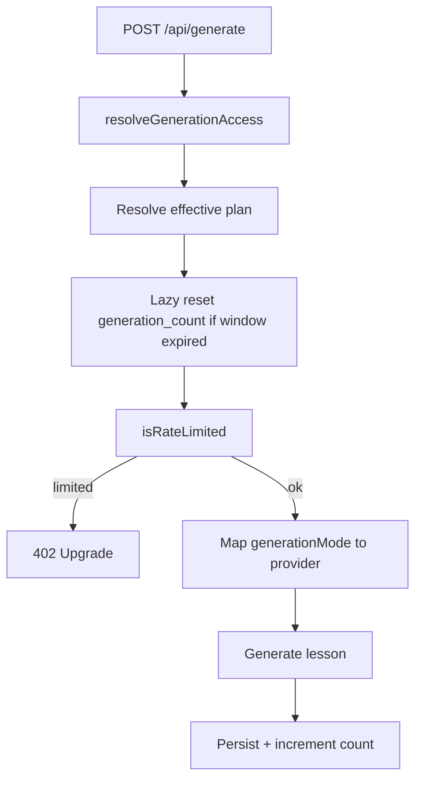

# Generation Limits and Fast / Quality Mode Design

## Goal

Align Free, Pro, and Pro+ generation quotas with marketing (3 / 20 / unlimited per billing window) and let Pro and Pro+ teachers choose Fast or Quality generation without exposing AI model names.

## Decisions

| Topic | Choice |
|-------|--------|
| Scope | Enforce monthly limits and add Fast / Quality mode |
| Free toggle UX | Show Fast / Quality; Quality locked behind upgrade |
| Reset window | Billing period for paid (`renews_at`); calendar month UTC for Free |
| Default mode | Remember last choice; Quality on first visit for paid |
| Trial limits | Match checkout plan (Pro trial = 20, Pro+ trial = unlimited) |
| Implementation | Extend `generation_count` + `generation_count_reset_at` (Approach 1) |

## Quotas and plan resolution

Centralize limits in `lib/ai/router.ts` (replace free lifetime `FREE_GENERATION_LIMIT = 50`):

| Effective plan | Limit per window |
|----------------|------------------|
| Free | 3 |
| Pro | 20 |
| Pro+ | unlimited (`null`) |

**Effective plan** from `lib/generation/authorize.ts`:

- `subscriptions.status === 'active'` and plan `pro` or `pro_plus` → that plan
- `status === 'trial'` with active `trial_end` → use `subscriptions.plan` (not a blanket `pro`)
- otherwise → Free

**Lazy reset** on authorize (before rate check) and before increment:

- **Free:** If `now` is past `generation_count_reset_at` (or it is null), set `generation_count` to 0 and set `generation_count_reset_at` to the start of the next UTC calendar month.
- **Paid / trial:** Treat `subscriptions.renews_at` as the period end. If the stored reset marker is stale relative to the current period (or null), reset count to 0 and set `generation_count_reset_at` to that period end. If `renews_at` is missing, fall back to calendar month UTC.

**Enforcement:** `isRateLimited(plan, count)` is true when the limit is finite and `count >= limit`. `POST /api/generate` continues to return **402** when limited.

**Increment:** +1 on successful persist in `lib/generation/persist.ts`. Fast and Quality count the same (1 generation each).

## Fast / Quality mode

**Teacher-facing meaning (no model names in product UI):**

- **Fast:** Quicker plans, good enough for most lessons. Implementation: Gemini Flash (`gemini-2.5-flash`).
- **Quality:** More thorough plans, slower. Implementation: Claude Sonnet (existing paid path, `claude-sonnet-4-6`).

**Eligibility:**

- Free: control visible on Generate; Fast selected; Quality disabled with a short upgrade hint.
- Pro / Pro+ / trial: both enabled.
- Server enforces: Free requests must not run Quality (ignore or coerce to Fast; never trust the client alone).

**UI:** Segmented control or radio pair on the Generate form (near submit), with one-line help under each option.

**Persistence:** `localStorage` key `fp-generation-mode` (`fast` | `quality`). Paid users default to Quality on first visit, then remember last choice. Free always submits Fast even if a Quality preference is stored.

**API:** Request field `generationMode: 'fast' | 'quality'`. `lib/generation/generate-content.ts` routes Fast → Gemini, Quality → Claude. Do not expose Claude variant IDs in the UI. Existing `modelPreference` Claude variants stay out of the product UI for this feature.

## Copy and surfaces

**Pricing (`PricingClient` PLANS):**

- Free: 3 lesson plans per month; Fast mode; keep upload/export/support bullets; remove “Gemini Flash model”.
- Pro: Everything in Free; 20 lesson plans per month; Fast and Quality modes; OCR; priority support; remove vague “smarter AI” as the sole differentiator without naming modes.
- Pro+: Unlimited lesson plans; Everything in Pro (includes Fast and Quality).

**UpgradePrompt:** Replace “5-lesson free plan limit” and inaccurate unlimited-Pro claims with Free 3 / Pro 20 / Pro+ unlimited and Fast / Quality language.

**Generate page plan prop:** Fix bug where `pro_plus` is treated as free for UI; pass real plan so Quality unlocks for Pro+.

**Dashboard / settings usage:** Show current-window usage (“X of 3 used”, “X of 20 used”, or “Unlimited”), not a lifetime total labeled as monthly.

**Legal:** Privacy / Terms may still name Google and Anthropic as processors. Teacher-facing marketing and in-app generate UI should prefer Fast / Quality.

## Errors and edge cases

| Case | Behavior |
|------|----------|
| Quota hit | 402; plan-aware copy (Free → upgrade for more than 3; Pro → Pro+ for unlimited). Optionally show remaining (“2 of 3 left this period”). |
| Free + Quality | UI locks Quality; server coerces to Fast or rejects. Prefer coerce for resilience if the client is outdated. |
| Missing API key for mode | Existing `map-error` paths (Gemini key for Fast, Anthropic for Quality). |
| Concurrent reset | Accept rare race for v1; no DB advisory locks unless tests force it. |
| SSR / hydration for mode | Default paid Quality / free Fast on server; hydrate preference from `localStorage` in `useEffect`. |

## Testing

- **Unit:** Limit constants; `isRateLimited`; reset window helpers; mode → provider mapping; Free cannot Quality on server.
- **Component:** Generate Fast / Quality control (locked Quality for Free; persistence).
- **Authorize / API:** Free at 3, Pro at 20, Pro+ never limited; trial follows `subscriptions.plan`.
- **E2E pricing:** Feature copy for 3 / 20 / unlimited and Fast / Quality language.

## Out of scope

- Quality costing more generations than Fast
- Claude Opus / Haiku picker
- Separate monthly usage table or lifetime analytics table
- Changing Lemon Squeezy prices or variant IDs

## Key files

| File | Change |
|------|--------|
| `lib/ai/router.ts` | Limits 3 / 20 / unlimited; rate-limit helpers |
| `lib/generation/authorize.ts` | Effective plan including Pro+ and trial-by-plan; lazy reset |
| `lib/generation/generate-content.ts` | Route on `generationMode` |
| `lib/generation/persist.ts` | Increment after successful save (unchanged contract) |
| `app/api/generate/route.ts` | Accept `generationMode`; 402 copy |
| `types/lesson.ts` | Add `generationMode` |
| `features/generate/components/GenerateForm.tsx` (and client) | Fast / Quality control |
| `features/billing/components/PricingClient.tsx` | Feature copy |
| `components/ui/UpgradePrompt.tsx` | Accurate limits and mode copy |
| `app/(app)/generate/page.tsx` | Pass `pro_plus` correctly |
| Dashboard / settings usage display | Current-window remaining |
| Tests listed above | Match new behavior |
